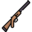

# Case study 1 and exercise submission  
> Written by 642115003 Kan Katpark  
> Email: kan_k@cmu.ac.th  
  
## Description
Case study project of EDD from SE233 Advance programming course.  

### Model
**Character Type**
| Name | Type  |  Weapon | Armor  |  
|---|---|---|---|
| Knight  | Physical  |  Sword, Shotgun |  Armor |   
| Mage  | Magical  |  Wand, Sceptre |  Shirt |   
| Berseker  |  Pure | Sword, Gun, Wand, Sceptre, Cutting board  | Apron   |   

### Weapon List  
 Name | Image  |  Status | 
|---|---|---|
| Sword |   | +10 Power |
| Shotgun |  | +20 Power|
| Wand |  | +30 Power|
| Sceptre |  | +30 Power|
| Cutting board |  | +40 Power|  

### Armor List  
 Name | Image  |  Status | 
|---|---|---|
| Shirt |   | +25 def +50 res |
| Armor |   | +50 def +25 res |
| Apron |   | +70 def +70 res |  

## Feature  
- [x] Add one more item to the item list, its image size should be equal to that of the other images.  

- [x] Create a new character type namely Berseker(BattleMage), whose fullHp and basedPower are both40. Note that you have to find your own image for the character and the image size must beequal to that of the other two character types.  

- [x] Put the dragged item back to in the inventory list, if it is not successfully dropped.  

- [x] Add a button to unequip the equipments from theEquipmentPane.  

- [x] Automatically unequip all the equipments after the character is regenerated.  

- [x] All the weapons have their own class determining by theDamageTypeenum. Our task is toto allow only weapons with the same class as the character be equipped. Note for Berseker(BattleMage),we allow it to equip any weapon but no armor can be equipped.

